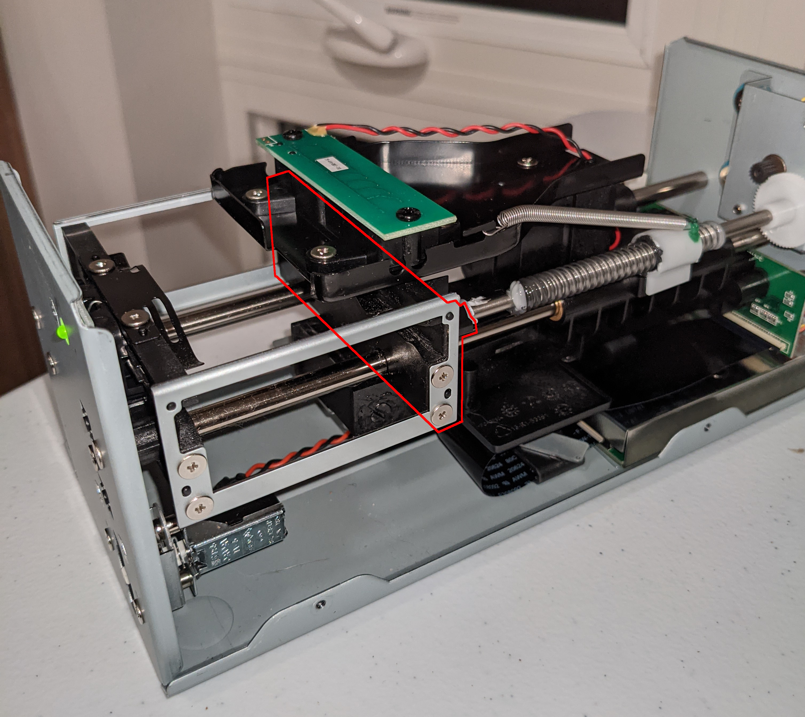
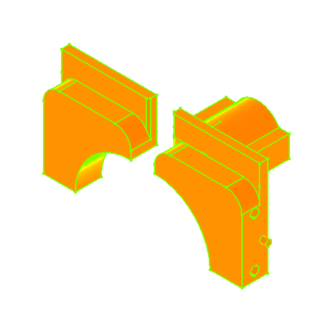
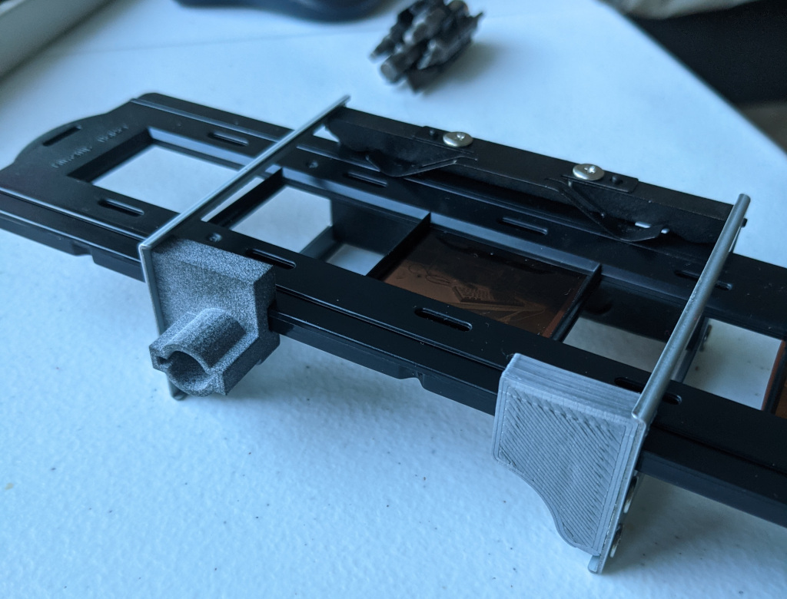
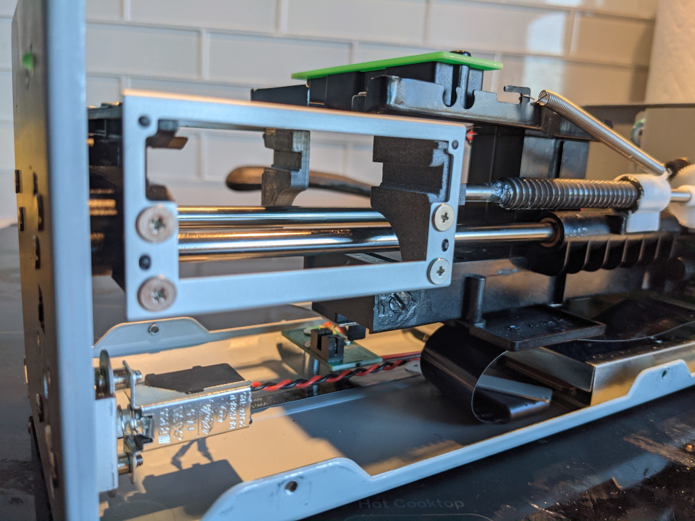
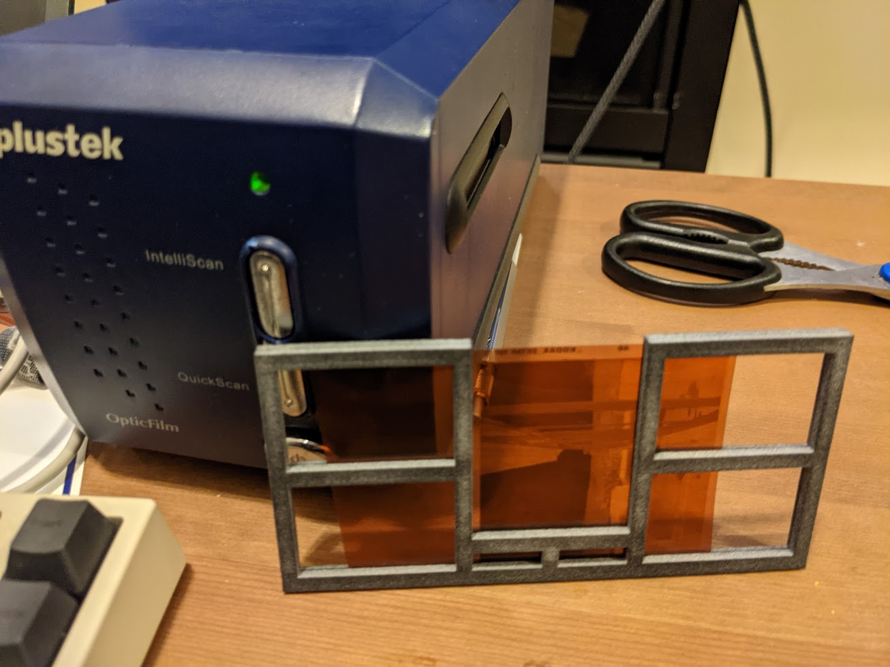
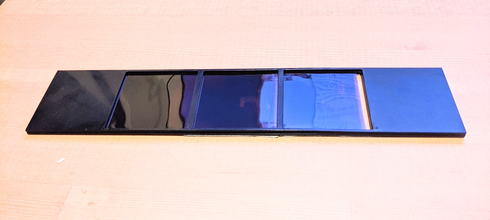
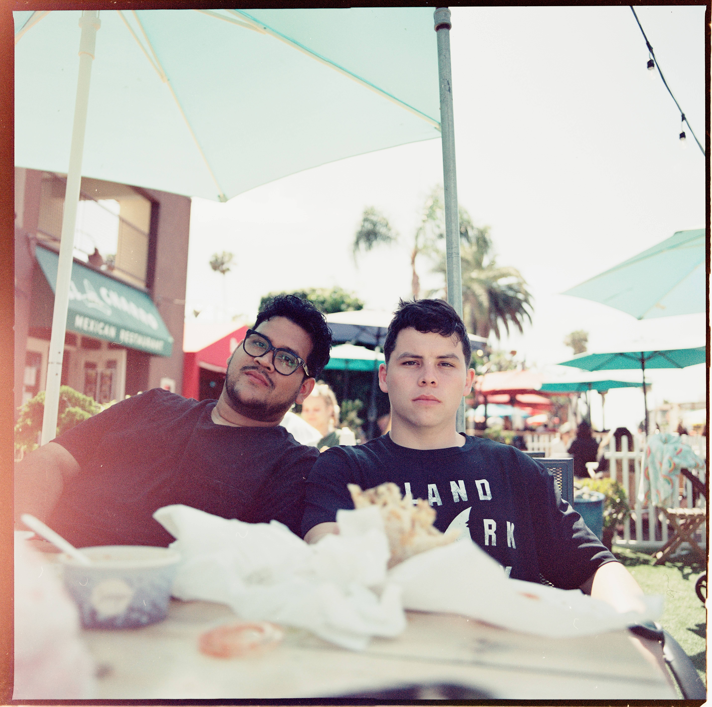
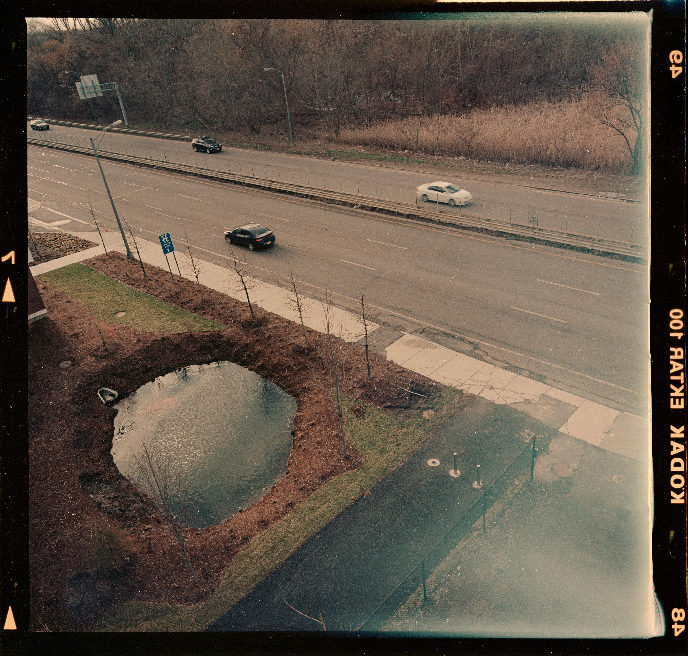

## 120 Scanning on a Plustek 8100 

> In the winter of 2021 I devised a method for scanning 120 film on a Plustek 8100. Although the method has severe shortcomings it got some recognition and I still occasionally receive emails about it. A few months ago I posted some words on my current thoughts on film scanning [here](https://news.ycombinator.com/item?id=42308234#42311993). Others in the thread seem to have found more successful approaches. Nonetheless, in case anyone wants to continue this work I have now included it here on Github.

- *Christian Chapman, 1/24/2025*

--

The Plustek 8100 is a relatively cheap and capable film scanner. 
It produces much nicer scans than most flatbed-type scanners, but it can only capture small format film. 
In this page I show how to modify a Plustek 8100 to scan medium format (120 film) by stitching together multiple scan sweeps. 
The motivation for this is that medium format film scanners tend to be rare and expensive, and this modified scanner can get you comparable results.

A single 6×7 frame takes around 6 minutes to capture at the scanner's highest resolution setting, so this method is around as convenient as [SLR scanning](http://natephotographic.com/dslr-film-scanning-perfect-color-negatives/) but without the setup and focusing hassle. 
This mod also lets you capture 35mm film including sprocket borders like this: [Link to example (not mine)](https://assets.community.lomography.com/bb/e70cb4366cf12652753c46bb747129e4ef0608/1216x821x2.jpg?auth=5bc244b9d1e883add291ea8a5ce2ab082d427a14). 
Two changes are involved:

 - Modify the driver to sweep the scan head longer than usual ("taller" in terms of the image plane).
 - Replace a part on the film carriage with one that avoids the scan head's field of view.

Most of this post likely applies identically to Plustek scanners of a similar build (7200, 7400, 7600i, 8200i) but I can't test this.

Here's a 6×7 scan I produced: 

## Software

The usual interfaces to this scanner only produce captures of a ~36×24mm region, the usual image surface for 35mm film.
Up until a few months ago this device was limited to use with expensive proprietary software (SilverFast, VueScan). 
No longer, thanks to a recent update to the `sane-genesys` backend ([Link to gitlab, cf sane-backends 1.0.31 NEWS](https://gitlab.com/sane-project/backends/-/blob/master/NEWS)). 
With this software, all that is needed to make the 8100 perform longer sweeps is to change some values in the source.
The necessary changes are in a github repository: [enthdegree/sane-backends](code/sane-backends) 
Only the `genesys` backend needs to be compiled. See the repo's `README.md` for compilation instructions.

A single medium format frame must be scanned at least 4 times and then stitched: once for each quadrant. 
An interface for this process is here: [plustek120.sh](code/plustek120.sh) 
The script automatically previews and captures the files, then runs them through a panotools autostitch procedure.
If something goes wrong during scanning, turn the scanner off and on again and the script continues gracefully.
 
Something has gone wrong with my used scanner hardware and now it creates really strong vertical bands right at the sample frequency when scanning at 7200 ppi. 
In plustek120.sh I include a low-pass filtering to get rid of this. 
The filter's stop frequency is well beyond the scanner's optical resolution ([Link to filmscanner.info](https://www.filmscanner.info/en/PlustekOpticFilm8100.html)) so there should be no significant loss in suppressing it. 

## Hardware

The pieces described here are hosted in the [parts/](parts/) folder and also on [Thingiverse](https://www.Thingiverse.com/thing:4726748).
They were drafted using FreeCAD.

### Carriage Replacement
The film carriage must be modified to enlarge the scanning stage. 
As it is, the scanner's view is obscured by the carriage for part of the sweep we want. 
Here a picture of the inside of the device and what needs to be removed: 

The replacement pieces are here: [plustek120_carriage.FCStd](parts/plustek120_carriage.FCStd).
The parts were printed in PLA12.
Below is a render of how they fit in mechanically.
I was conscious of keeping the scan head aperture clean during reassembly. 

### Film Holder
A good film holder hasn't been designed.
It needs fit in the scanner, keep the film flat and be convenient to reposition.
The scanner's focus plane seems to lie somewhere between 2 and 3 mm over the carriage floor.
This is difficult to measure precisely so I correct for this with layers of tape along the bottom of the tray. 
Broadly I have made three attempts, the first being the most successful:

3D printed snap-fit tray [plustek120_tray.FCStd](parts/plustek120_tray.FCStd):

Then die-cuts of this shape: [scan_tray.svg](parts/scan_tray.svg) in both acrylic and aluminum, both which were very awkward to use.
 

## Examples

Here are a few more darktable inversions, (plus some dust, light leaks, missed focus and fingerprints):

